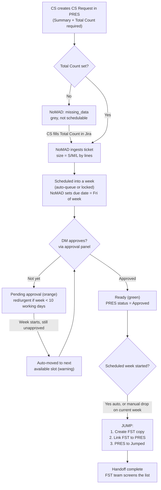

# PRES Ticket Lifecycle: Creation -> Approval -> Handoff

How a ticket flows from Customer Success (CS) creating it in the `PRES` board, through
Data Management (DM) approval, to handoff onto the `FST` board — as implemented by the
NoMAD scheduler.

## Roles
- **Customer Success (CS)** — creates tickets in the `PRES` (CS Prescreen) Jira board.
- **Data Management (DM)** — approves tickets. In NoMAD this action requires a NoMAD admin role.
- **NoMAD App** — the scheduler. Reads PRES tickets, orders them into weekly capacity, sets
  due dates, and at the right time "jumps" them onto the `FST` (Full Screening Team) board.
  Runs as the "NoMAD App" Jira service account.

## System boundary (important)
NoMAD has **no ticket-creation endpoint**. Tickets are created **directly in Jira** by CS.
NoMAD only reads (`GET /api/tickets`, JQL `project = PRES AND status != Done`), then schedules,
approves, and jumps. So "creation" = a normal Jira issue create in PRES.

---

## Step 1 — CS creates the ticket (in Jira, PRES board)

Issue type: **CS Request**.

### Fields
| Field | Jira ID | Required? | Purpose / notes |
|---|---|---|---|
| Summary | `summary` | Yes (Jira system) | Ticket title. Copied to the FST ticket on handoff. |
| **Total Count** | `customfield_10142` | **Yes (mandatory)** | The number of "lines". Drives sizing and scheduling. Without it NoMAD marks the ticket `missing_data` and it **cannot be scheduled**. |
| Screening List Link | `customfield_10128` | Optional | URL to the list to screen. NoMAD tracks whether it's present (`has_screening_link`). |
| Screening Due date | `customfield_10127` | Do **not** set manually | NoMAD writes this when it schedules (Friday of the assigned week), alongside the standard `duedate`. |
| Assignee | `assignee` | Optional | Copied to FST on handoff. |
| Priority | `priority` | Optional (defaults "normal") | Copied to FST. |
| Description | `description` | Optional | Copied to FST. |
| Labels | `labels` | Optional | Copied to FST. |
| Customer Id / From_EOI / User ID / DM - Delay Reason / [DM] Request Type | `customfield_10036` / `_10078` / `_11613` / `_12238` / `_13806` | Optional | Present on the CS Request screen; not used by NoMAD's scheduling logic. |

### Ticket "size" is derived from Total Count
NoMAD buckets tickets by line count (`getTicketSize`):
- **Small**: `< 500`
- **Medium**: `500–1500`
- **Large/Big**: `> 1500`

Size determines which reserved slice of a week's capacity the ticket consumes.

---

## Step 2 — NoMAD ingests and schedules

Once the ticket exists in PRES (and is not `Done`), it appears in NoMAD with one of three states:

- **Missing data** (grey, not draggable) — no Total Count. Must be fixed in Jira first.
- **Pending approval** (orange) — has Total Count but not yet Approved. It **can** be scheduled
  while orange. Turns **red/urgent** when its scheduled week is within 10 working days and it's
  still unapproved.
- **Ready** (green) — has Total Count and is Approved.

Scheduling happens two ways:
- **Automatic queue** — tickets flow, in priority order, into the next weeks that have free
  capacity (respecting per-size reservations), grouped into week swimlanes.
- **Locked to a week** — a planner drags a ticket onto a specific week; NoMAD checks
  size-specific capacity and either accepts it, offers a multi-week overflow, or blocks it.

When a ticket is scheduled, NoMAD sets the **due date = Friday of the assigned week** in both
`duedate` and `Screening Due date` (`customfield_10127`).

---

## Step 3 — DM approves

- Approval is done in NoMAD via the **approval panel** ("Eszter's Space"), which calls
  `POST /api/tickets/approve`. This endpoint is **admin-only** (`require_admin`), so DM
  approvers need the NoMAD admin role.
- **Eligibility checks** before approval: ticket must have Total Count, must not already be
  Approved, and must not already be Jumped.
- On approve, NoMAD transitions the PRES issue to the **`Approved`** status using the NoMAD
  service account. The action is logged and broadcast to other connected users in real time.

**Workflow caveat (Jira admins):** the PRES "Approve" transition is conditional. NoMAD first
tries the normal transition, then retries with `includeUnavailableTransitions`. If a hard
workflow condition still blocks the service account, approval fails with a message telling the
admin to allow the "NoMAD App" principal on the Approve transition
(PRES project settings -> Workflows -> Approve -> Conditions).

---

## Step 4 — What happens once Approved

1. The ticket turns **green (Ready)** in NoMAD.
2. If it's Approved **and** its due date is within ~10 working days, it shows a
   **"Ready to jump"** banner.
3. **Handoff ("Jump")** happens when the ticket's scheduled week begins:
   - Automatically: when the scheduled **week starts (Monday)**, NoMAD auto-jumps approved
     tickets in the current week.
   - Manually: a planner can drop an approved ticket onto the current week to trigger an
     immediate jump.
4. The Jump workflow (`process_jumped_ticket`) does three things:
   1. **Creates a copy on the `FST` board** (Full Screening Team) — copying summary,
      description, assignee, due date, Total Count, Screening Due date, priority, and labels.
   2. **Links** the FST ticket back to the PRES ticket.
   3. **Transitions the PRES ticket to `Jumped`** (terminal in NoMAD).
   - The PRES ticket then shows a "Jumped" badge with a link to its `FST-###` counterpart.

> Only **Approved** tickets can be jumped/handed off. An unapproved ticket will never create an
> FST ticket.

---

## Automations & edge cases
- **Unapproved at week start -> auto-moved.** If a ticket's scheduled week arrives and it's
  still not Approved, NoMAD pushes it to the next available slot and warns:
  "N tickets auto-moved to next available slot (pending approval)." (`processAutoQueue`)
- **Expired tickets.** Tickets scheduled in a past week that were never completed are surfaced
  in an alert and can be auto-returned to the backlog.
- **Direct-in-Jira edits -> mismatch.** If someone changes the due date or Total Count directly
  in Jira after NoMAD scheduled it, the ticket is flagged as a mismatch; "Reset" clears the Jira
  due date and returns it to the backlog so it can be rescheduled cleanly.
- **Over-capacity warning.** When reshuffling pushes a week's swimlane past capacity, NoMAD
  shows a toast that the lane is over capacity.

---

## Status glossary
- **(open / initial)** — newly created by CS; schedulable once Total Count is present.
- **Approved** (`APPROVED_STATUS`) — DM has approved; eligible to jump. Required for
  current-week scheduling.
- **Jumped** (`JUMPED_STATUS`) — handed off; FST copy exists; terminal in NoMAD.
- **Completed statuses** (no expiry alerts): `Jumped`, `Done`, `Closed`, `Completed`, `Resolved`.
- NoMAD ignores anything already `Done` (JQL excludes it).

## Flow diagram

## Source references
- Statuses, fields, jump/approval logic: `backend/jira_client.py`
- API endpoints (approve, jump, due-date, etc.): `backend/main.py`
- Ticket states, sizing, week helpers: `frontend/src/types/ticket.ts`
- Approval UI: `frontend/src/components/ECPanel.tsx`
- Auto-queue / expired / jumped automations: `frontend/src/hooks/useJiraTickets.ts`
